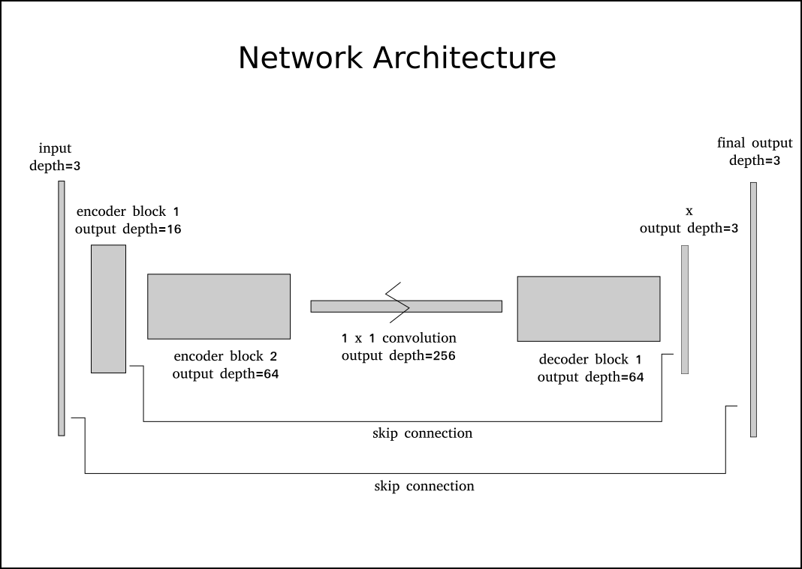
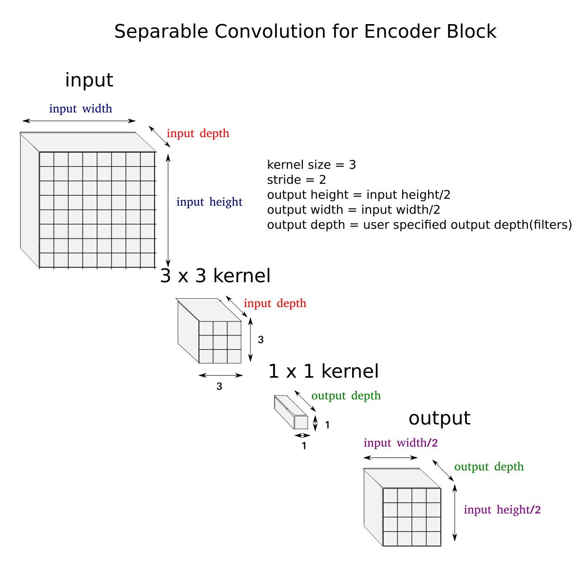
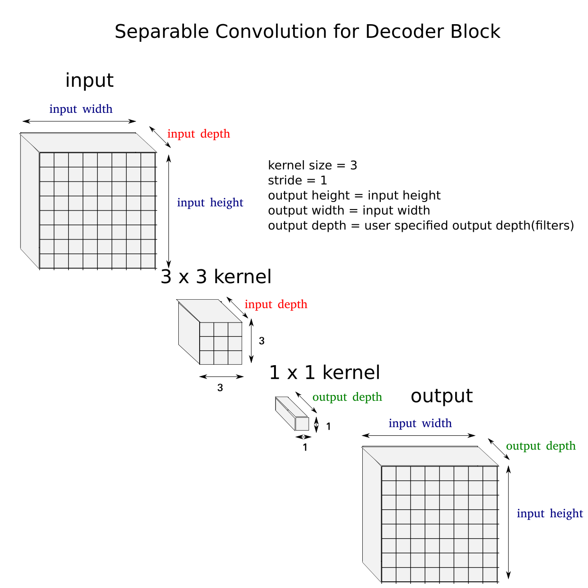
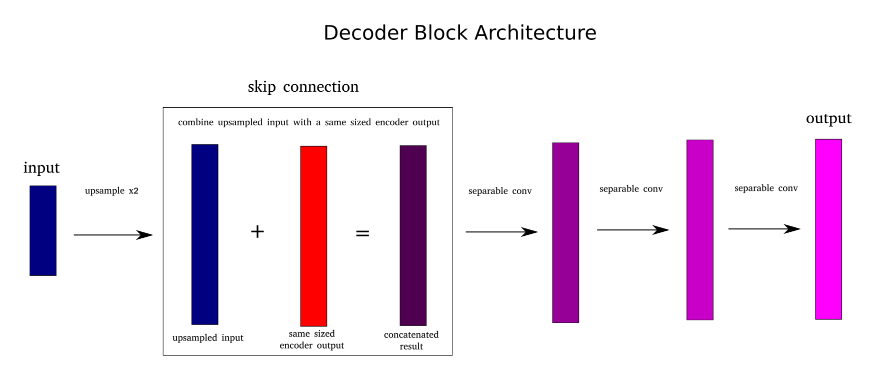

# Deep Learning Project Writeup

This writeup was prepared for the benefit of the Udacity Robotics Nanodegree Deep Learning Project. The intent is to document and clarify the decisions and the reasons behind these that were made in the project. 

## Network Architecture
In this project, we are using a Fully Convolutional Neural Network to help us in image segmentation and object identification. That is, the neural network will help us identify a target object in an image, and at the same time tell us what specific part of the image the object is at. To be specific, we will be using images taken by a simulated drone, identify and detect the presence of a particular human that the drone has been tagged to follow (referred to as the hero), identify which part of the image the hero is in, and also differentiate the hero/target from any other people that may be found in the image, as well as any other background features.

For this challenge, we will be using a Fully Convolutional Neural Network that has 5 layers.  Two (2) encoding layers, one 1 x 1 convolutional layer, and two (2) decoding layers, with the last decoding layer serving as the output layer which returns the result.

Below is an illustration of the final network architecture.

As can be seen in the image, the network is composed of five(5) layers.  Two(2) encoders, one(1) convolutional 1x1 layer, and two(2) decoders. Although a convolutional 1x1 layer is mentioned only once in the overview of the network architecture, 1x1 convolutions are actually used in every layer of the network in the form of separable 2d convolutions. These 1x1 convolutions assist us in dimensional reduction, resulting in sped up and less memory intensive computations. 1x1 convolutions also return outputs with any depth or number of filters that we want or specify.

Each encoding layer performs a *depthwise separable convolution*. This requires less compute resources as opposed to using normal convolutions. It is able to accomplish this by significantly reducing the total number of parameters necessary for the computations. Paul-Louis Pröve in his blog post entitled "[An Introduction to different Types of Convolutions in Deep Learning][1]" provides a couple of examples illustrating this difference:

> Let’s say we have a 3x3 convolutional layer on 16 input channels and 32 output channels. What happens in detail is that every of the 16 channels is traversed by 32 3x3 kernels resulting in 512 (16x32) feature maps. Next, we merge 1 feature map out of every input channel by adding them up. Since we can do that 32 times, we get the 32 output channels we wanted.

> For a depthwise separable convolution on the same example, we traverse the 16 channels with 1 3x3 kernel each, giving us 16 feature maps. Now, before merging anything, we traverse these 16 feature maps with 32 1x1 convolutions each and only then start to them add together. *This results in 656 (16x3x3 + 16x32x1x1) parameters opposed to the 4608 (16x32x3x3) parameters* from above. (emphasis mine)

In our case, we also use a kernel size of three (3) but with input and output channels that were identified in the above image of the network architecture. Stride for each encoding layer is two (2), which basically halves the succeeding output's width and height for each encoding layer present. Results are also batch normalized before being returned as output.

Below is an illustration of the separable convolution used for our encoding blocks

Once done with the encoder blocks, output is then passed as input onto a convolutional 1x1 layer. The kernel size for this layer is one (1) as the name implies, and also with a stride of one (1). A fully connected layer normally serves as the output layer for Fully Convoluted Networks whose aim is to simply identify or classify objects found in images. In our case, this image identification is performed by this 1 x 1 convolutional layer instead, not by a fully connected layer. However, since our objective is also to locate which part of the image these objects are in, we need to have additional steps and layers after this.

These steps and layers are referred to as our decoder blocks. Our decoder blocks are fairly more complex than the previously discussed encoder block as well as the 1 x 1 convolutional layer.  It has 3 main subparts, namely: the input upsampling part, skip connection part, and the additional convolutions part. The upsampling part takes the input, and increases its width and height by a factor of two. This is done through what is called a *transposed convolution*. The skip connection part concatenates the upsampled data with the corresponding encoder output with the same dimensions. This would allow us to retain information that the image has lost after going through multiple reductions of height and width. Another way of thinking of this is that skip connections allows us to "fill in the blanks" of the upsampled data. And lastly, we pass the data onto three(3) succeeding separable convolution layers with a stride of one(1) before returning the output.  The stride of 1 guarantees that there is no change in the width or height of the data. We also obtain an output with the desired number of output depth or filters by passing the intended value using the "filters" parameter.

Below is an image for the separable convolution used within the decoder blocks. Note that the output width and heights remain the same as the inputs, as opposed to the encoder blocks where these are halved.

Below is an illustration of the decoder block's architecture. It is more complex than that of an encoder block which is simply composed of one separable convolution with a stride of 2. The decoder block on the other hand involves an upsampling step, a skip connection, as well as three succeeding separable convolutions.

### A note regarding fully connected layers, convolutional layers, and 1 x 1 convolutions

Neural Networks used for image classification normally have one or two fully connected layers found at the end the network prior to returning the result. These last two fully connected layers are ultimately used to classify the content of the image input.  Each node in each "fully connected layer" is "fully" connected to each node of the previous layer.  The intuition is that these fully connected layers need to make sense of all the nodes in the previous layer, and how each node relates to each other.

This is in contrast with convolutional layers (also called dense layers). In convolutional layers, each *output* node is not connected to each *input* node.  Instead, each ouput node is only connected to a *subset* of input nodes.  Normally, this subset of input nodes are nodes that are grouped together, or found besides each other. The widths and heights of the grouping of these nodes are normally determined by the width and height of the filter being used for the convolutions.

In our particular network architecture, the middle 1x1 layer is convolutional, however, it still performs the image identification portion which is normally performed by a fully connected network.  The encoding layers funnel the image until it reaches the 1x1 layer which in turn classifies the objects found in the image.  Once the objects have been classified, the decoding layers after this 1x1 layer are later on used to ensure that spatial information is preserved, and that the final output shows where each object is located in the image.

## Setting the Network Parameters
Training the model requires specifying several hyperparameters.  This section of the writeup will attempt to discuss these parameters, indicate the values used, and clarify why such values were chosen.

1. learning_rate
    - Value used: 0.01
    - What is the learning rate?: The learning rate is a value that sets how quickly (or slowly) a neural network makes adjustments to what it has learned while it is being trained. In more concrete terms, it is a numerical value (usually less than 1) that we multiply to either the error minimization rate we get from logistic regression, or multiply to the gradient we get from gradient descent. A value of 1 means that we take the gradient or error minimization rate as is and make adjustments at that value.  A value of 0.10 would mean that we make learning adjustments at 10% the rate of the computed gradient or error minimization rate. As an example, if the error minimization rate is +10 and the learning rate is 1, then we make an adjustment with the value of +10.  However, if the learning rate is 0.1 then we only make an adjustment of +1.
    - What makes for a good learning rate?: The ideal learning rate would allow a neural network to reach the gradient descent and error minimization minimums at the least amount of time, without causing overfitting.
    - How to obtain the best learning rate?: Every neural network and model has its own optimal learning rate.  Determining this amount normally involves testing different values to see which value would be most effective.
    - What happens if we use the wrong learning rate?: Using learning rates that are too large would cause error rates to increase instead of decrease. Using learning rates that are too small may cause overfitting, apart from needlessly prolonging learning times.
    - Justification for the learning rate used: This is the default learning rate provided in the project. Learning rates of 0.003, 0.002, and 0.001 were also used. Given the same number of training time or epochs, the aforementioned 3 learning rates allowed the error or loss values to plateau at generally lower rates as compared to the 0.01 learning rate, at the cost however of more epochs. Several training runs however showed that training with 0.01 as the learning rate still allowed for final score values that are fairly close to the requirement. As such, instead of constantly tweaking the learning rate, we focused our efforts on improving other parts of the project.

2. num_epochs
    - Value used: 25
    - What is an epoch?: Ideally, an epoch is a single run that will let the model use or "see" all the available training data to minimize its errors. Basically, an epoch is a single complete pass over all (or most) of the available training data.
    - What makes for a good value for an epoch?: The ideal number of epochs would be the lowest possible value that would still be able to fully minimize the error rates of the neural network being trained, and avoid overfitting at the same time.
    - What happens if we use the wrong number of epochs?: A too low number of epochs would be insufficient in training the neural network to reach an acceptable error or loss rate, rendering it incapable of properly performing its intended function (i.e. the neural network won't be good enough to actually be useful for what it was designed, in our case, detecting an identified object). A too high number of epochs May cause overfitting, meaning the neural network may become very good at performing its tasks while using the training set. However, once it is fed non-training set data, it would not be able to perform in an acceptable manner. Furthermore, using more epochs than that which is necessary would be a waste of compute resources.
    - Justification for the number of epochs used: The number of epochs used started off at a low value of 5, and was increased to 8, 10, 15, 20, then 25 when it seemed like the neural network was still capable of pushing loss and error rates downward, and that a low number of epochs was prematurely interrupting the neural network from reaching the minimum error plateau. In other words, instead of continuing to minimize the loss or error rates, the neural network stops computing because the number of epochs were already exhausted. This is even before the error rates have reached a plateau. Increasing the number of epochs was also done as the network's layers increased in "thickness", or when additional layers were added. When network "depth" increased, error rates tended to reach its minimum plateau at a slower rate, necessitating more epochs to reach these plateau values. 

3. batch_size
    - Value used: 40
    - What is the batch size?: The batch size is the number of images that are processed together as a batch for every step of the epoch or the training period. So in this instance, for every step of training, 40 images are taken from the training set and are used for the gradient descent step to minimize the error or loss value.
    - What makes for a good batch size?: A good batch size would be one that is large enough such that it can still be handled by available computing resources, but at the same time not too large to cause overfitting. It should also be small enough but not too small. If the batches are too small, the neural network may have difficulty forming its generalizations.
    - Justification for the batch size used: The default value provided by the project was 20 images, and it was for a training set with more than 4000 images. In this project's instance, the author used image flipping (obtaining mirror image copies of the training data) effectively doubling the training set to more than 8000 images.  As a response, the batch size was also doubled to 40. 

4. steps_per_epoch
    - Value used: 200
    - What are the steps per epoch?: A training step is basically one gradient update or one error loss update. This is the number of image batches the neural network has to go though during training. In our instance, the batch size is 40, meaning the neural network uses 40 images every time it computes and updates the gradient and error. Since there are 200 steps per epoch, we end up processing 8000 images (40 x 200) for each epoch.
    - What makes for a good value of steps for an epoch?: The value would be based on the chosen batch size. Normally the number of steps chosen would be such that all the available training images would be used for each epoch. In our instance, we have more than 8000 training images. We divide 8000 by our batch size (40) to get 200 steps in each epoch.
    - Justification for the number of steps used: This is the default value provided in the project. The value worked fairly well, so it has not been changed.  The author did however experiment with the value of steps per epoch at 50, but the final scores returned of these attempts were fairly low, and had far too many weight, IoU, and final score values of 0.
    
5. validation_steps
    - Value used: 50
    - What are validation steps?: Similar to steps_per_epoch, but instead of using training data, we use validation data.
    - Justification for the number of validation steps used: This is also the default value provided by the project.
    
6. workers
    - Value used: 4
    - What are workers?: According to the Keras documentation, workers are the number of instances to spin up. The project notes imply that this value is ultimately limited by available compute resources.
    - Justification for the number of validation steps used: Different values were tried, from the default value of 2, 4, and even 20 to 100. Larger values tended to significantly slow down the initialization of gradient descent computation. However, the speed at which epoch computations were finished did not seem to improve significantly even with higher worker numbers.

## Results and Discussion
Multiple runs were initially performed using different numbers of layers and layer depths at lesser steps per epoch (40 steps per epoch instead of 200 steps), starting from 3 layer networks (1 encoder, 1x1 fully connected layer, 1 decoder) to 9 layer networks (4 encoders, 1x1 fully connected layer, 4 decoders).  The initial values for the depths were doubled for each encoder up to the 1x1 convolution layer, then halved for each decoder until the output.  For example, a 5 layer network was run with layer depths of (8, 16, 32, 16, output depth) up to layer depths of (32, 64, 128, 64, output depth). Initial runs showed that 9 layered networks produced the least number of results that returned 0 for the weights, IoU, and final score, and that the returned scores are generally higher than those found in networks with less layers. As such, we focused on training 9 layer networks with layer depths of (32, 64, 128, 256, 512, 256. 128, 64, output depth), at the normal number of steps (200 steps x 40 images per batch or step) per epoch. After performing 28 runs (of 20 epochs each) using the aforementioned parameters, 0.4490 was the highest final score obtained. Furthermore, typical final scores were underwhelming, and are mostly in the 0.20 - 0.30 range, and final scores of 0.0 were fairly common. Getting final scores that were above 0.35 was fairly rare.

However, some experimentation in quadrupling depth sizes with each encoder instead of doubling them resulted in more consistent and generally better results. In our case, utilizing a 5 layer network, with depth sizes of (16, 64, 256, 64, output depth), at 20 epochs for each run, returned final scores that were consistently better than the previous results.  No final score returned for this configuration was beneath the value of 0.20. Furthermore, scores above 0.40 were fairly common, and constituted about half of the results. And after 19 runs, the highest score of 0.4756 was obtained.

# TODO explain current experimentation when final layer depth of output_depth was replaced with 16
Further experimentation however was done upon the author's realization that it was not necessary to use "output_depth" (which had a value of 3) as the last depth size for the final decoder. As such multiple runs were performed once again, replacing the value of 3 with 16 for the depth of the final decoder, such that the final set of depth sizes was (16, 64, 256, 64, 16) instead of (16, 64, 256, 64, output depth(3)). For the initial set of 24 runs at 20 epochs per each run, the lowest final score obtained was 0.3555 and the highest score obtained was 0.4796. Only five (5) out of the 24 runs (20.83%) had a final score below 0.30. Six (6) out of the 24 runs (25%) were above 0.45, and the rest (13 out of 24 runs or 54%) had scores from a range of 0.40 to 0.45. These figures represent a significant improvement over previous results, however, the increase in the highest score obtained, though exceeding the previous record, only posted a 0.0040 improvement over the previous high.

# TODO indicate the results of running using 25 epochs per run
To further improve the results, the author increased the number of epochs from 20 to 25.

The network architecture for these runs is the final form used in this project, and presented in this writeup.

## Limitations and Potential Improvements
Training and validation data used for all runs were the default ones provided in the project, with the single change of making flipped and mirrored copies of the images to effectively double the amount of training data, from around 4000 images, to more than 8000 training images. But despite this, further improvements to the final score could be achieved by obtaining more training data.

Regarding the use of the same model and data to detect and follow other people or objects, this would not be possible for the current model since it has been trained for a particular image or likeness of a person. However, we could use the same network architecture to train and produce separate models for other objects we would want to be able to detect.  The primary requirement for us to achieve this would be to collect training data that is particular for the person/object of interest, and train a model using this data on the presented network architecture.

# TODO remove this final paragraph and replace
Lastly, correcting the desired depth/filter value of the last decoder block to the same value as the first encoder block (16) may possibly improve results further. Setting the filter value of the last decoder to the given number of classes may not be necessary since the final step after the last decoder block performs this for us. The current filter values involve a sudden drop from a value of 64 to 3, instead of first being cushioned to a value of 16, then to 3. Changing 3 to 16 may soften this drop and may improve model performance.

[1]: https://medium.com/towards-data-science/types-of-convolutions-in-deep-learning-717013397f4d "An Introduction to different Types of Convolutions in Deep Learning"